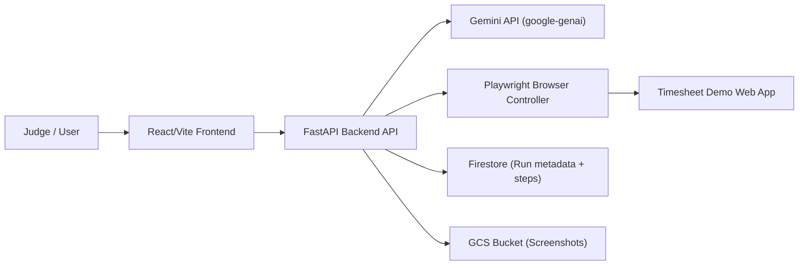

# ScreenPilot – Gemini UI Navigator Agent

ScreenPilot is a focused **UI Navigator agent** built for the [Gemini Live Agent Challenge UI Navigator track](https://geminiliveagentchallenge.devpost.com/). It looks at **real browser screens**, uses **Gemini + Playwright** to understand the UI, and then controls the browser end‑to‑end to complete a specific workflow: a **timesheet demo app**.

- **Public repo URL (for Devpost):** `https://github.com/chinmaynawkar/screen-pilot`
- **Demo scenario:** “Fill my weekly timesheet” on a controlled demo web app.

---

## 1. Project Overview & Pitch

### Problem

Filling repetitive web forms (timesheets, ticket systems, internal tools) is **boring, error‑prone, and time‑consuming**. Existing automations are often:

- Brittle (tied to DOM selectors that break on UI changes),
- Opaque (no clear reasoning or visual explanation),
- Hard to trust (no easy way to see _why_ a bot clicked something).

### Solution & Value – ScreenPilot

ScreenPilot is a **browser copilot** that:

- Sees the screen via **Playwright screenshots** and **Gemini’s computer‑use / vision capabilities**.
- Plans actions (click, type, scroll) to complete a **timesheet workflow** end‑to‑end.
- Executes actions in a real browser, showing:
  - A **live timeline** of steps (Decision → Why → Action → Outcome),
  - **Latest screenshot** and mini “film strip” of evidence,
  - A **run summary** with duration, step count, and failures.

**Value for users and judges:**

- Demonstrates a realistic, high‑value workflow (weekly timesheet) instead of a toy example.
- Highlights **visual precision** (Gemini reasons about the UI from screenshots, not just DOM).
- Provides strong **observability and safety**: clear logs, confirmation before irreversible actions, and reproducible runs.

---

## 2. Key Features

- **Task selector & parameters**
  - Choose the “Fill weekly timesheet” task.
  - Provide simple parameters (e.g. week range, hours per day).

- **Planner + executor loop**
  - Backend planner asks Gemini how to act on the current screenshot.
  - Maps structured actions to Playwright (clicks, typing, scrolling).
  - Repeats until the timesheet is fully filled or a stop condition is reached.

- **Run timeline & live UX**
  - React frontend shows each step with Decision / Why / Action / Outcome.
  - Live screenshot stage and small thumbnail strip.
  - Final summary with success/failure, counts, and final screenshot.

- **Persistence (GCP mode)**
  - Firestore stores run metadata and step logs.
  - Cloud Storage (GCS) stores screenshots and serves signed URLs.

- **Cloud‑ready & automated deployment**
  - Backend is containerized with a Playwright base image.
  - `backend/scripts/setup_docker_env.sh` and `backend/scripts/deploy_cloud_run.sh` automate **Cloud Run** setup and deployment.

---

## 3. Architecture Overview

See the dedicated architecture document (with the full diagram and explanation):

- [`docs/architecture.md`](docs/architecture.md)

High‑level flow:



1. **Frontend (React + Vite + Tailwind)**
   - Single‑page app for configuring tasks, starting runs, and visualizing logs/screenshots.
2. **Backend (FastAPI)**
   - Exposes run APIs, orchestrates planner + executor loop, and calls Gemini & Playwright.
3. **Gemini (google‑genai / Gemini API)**
   - Receives the user’s goal plus screenshots, returns structured actions and reasoning.
4. **Playwright (Python)**
   - Controls a Chromium browser against the **Timesheet demo web app**, captures screenshots.
5. **GCP Services (optional, but enabled in “GCP mode”)**
   - **Cloud Run:** hosts the backend container.
   - **Firestore:** stores runs and step logs.
   - **Cloud Storage:** stores screenshots and serves signed URLs to the frontend.

The diagram above (and the version in `docs/architecture.md`) can be exported as an image and uploaded to Devpost’s file / image carousel.

---

## 4. Tech Stack

- **Frontend**
  - React + TypeScript + Vite
  - Tailwind CSS

- **Backend**
  - FastAPI (`fastapi[standard]`)
  - Uvicorn (`uvicorn[standard]`)
  - Pydantic models for request/response schemas

- **Agent & browser control**
  - Gemini via `google-genai` / Gemini API client
  - Playwright (`playwright==1.58.0`) using the official `mcr.microsoft.com/playwright/python` base image

- **Cloud & persistence**
  - Google Cloud Run (backend hosting)
  - Firestore (run + step metadata)
  - Google Cloud Storage (screenshots)

- **Tooling & tests**
  - Pytest and HTTPX for backend tests
  - ESLint & TypeScript for frontend correctness

Data sources used:

- **Timesheet Demo Web App** – controlled target for the UI Navigator to operate on.
- **Firestore collections** (`runs`, `runSteps`) – store structured logs of each run.
- **GCS bucket** (e.g. `screenpilot-shots`) – holds run screenshots for replay in the frontend.

---

## 5. Quickstart for Judges (Local – Backend + Frontend)

This section is optimized so Devpost judges can clone, run, and see the demo with minimal friction.

### 5.1 Prerequisites

- Python **3.10+**
- Node.js **18+** (or latest LTS) and npm
- Google Gemini API key (`GEMINI_API_KEY`) with access to computer‑use / vision models
- Optional but recommended: `gcloud` and Docker (for Cloud Run deployment)

### 5.2 Clone the repository

```bash
git clone https://github.com/chinmaynawkar/screen-pilot.git
cd screen-pilot
```

### 5.3 Run the backend (FastAPI + Playwright) locally

Create and activate a virtualenv, install dependencies, and run the app:

```bash
python -m venv .venv
source .venv/bin/activate  # Windows: .venv\Scripts\activate

pip install --upgrade pip
pip install -r backend/requirements.txt

# Install Playwright browser runtime (once)
python -m playwright install chromium

# Export your Gemini API key
export GEMINI_API_KEY="your-key-here"

# Start FastAPI backend on http://127.0.0.1:8000
uvicorn backend.app.main:app --reload --port 8000
```

Health check:

- Open `http://127.0.0.1:8000/docs` in your browser.

### 5.4 Run the frontend (React + Vite)

From a **second terminal**:

```bash
cd frontend
npm install

cp .env.example .env
# Edit .env and set:
# VITE_BACKEND_BASE_URL=http://127.0.0.1:8000

npm run dev
```

Open the Vite dev URL (usually `http://127.0.0.1:5173/`) and:

1. Select the timesheet task.
2. Fill in demo parameters.
3. Click **Run** and watch the live log and screenshots as ScreenPilot fills the timesheet.

For more details:

- Frontend docs: [`frontend/README.md`](frontend/README.md)
- (Optional) Backend‑specific notes: [`backend/README.md`](backend/README.md) – if you prefer backend‑only instructions.

---

## 6. Cloud Deployment (Automated) – Proof for Devpost

ScreenPilot includes **scripts and Docker configuration** that fully automate backend deployment to **Google Cloud Run**.

### 6.1 One‑time Cloud setup

From the repo root:

```bash
cd backend

# Configure Google Cloud project, Artifact Registry, bucket, Firestore, and IAM
PROJECT_ID="your-gcp-project-id" \
REGION="your-region" \
./scripts/setup_docker_env.sh
```

What this script does (summarized):

- Ensures required APIs are enabled (`run.googleapis.com`, `cloudbuild.googleapis.com`, `artifactregistry.googleapis.com`, `firestore.googleapis.com`, `storage.googleapis.com`, `iam.googleapis.com`, `iamcredentials.googleapis.com`).
- Creates an **Artifact Registry** repo for backend images.
- Creates a **GCS bucket** for screenshots (e.g. `screenpilot-shots`).
- Ensures a **Firestore** Native database exists.
- Creates a **runtime service account** with the correct IAM roles (Datastore user, Artifact Registry reader, Storage object admin, service account token creator).
- Configures Docker auth for Artifact Registry.

### 6.2 Build and deploy to Cloud Run

With your environment prepared and `GEMINI_API_KEY` set:

```bash
cd backend

export GEMINI_API_KEY="your-key-here"

# Optional: override defaults
# export PROJECT_ID="your-gcp-project-id"
# export REGION="asia-south1"
# export SERVICE_NAME="screenpilot-backend"
# export REPOSITORY="screenpilot"

./scripts/deploy_cloud_run.sh
```

What this script does:

- Builds a container image using `backend/Dockerfile`:
  - Either with local **Docker** or **Cloud Build**, depending on `BUILD_MODE` and local tools.
- Pushes the image to Artifact Registry.
- Deploys to **Cloud Run** with:
  - `GEMINI_API_KEY`, `PERSISTENCE_BACKEND`, Firestore and GCS settings, and the **Timesheet demo URL** passed as environment variables.
  - Public (unauthenticated) access on port `8000`.
- Prints:
  - **SERVICE_URL** – for example: `https://screenpilot-backend-xyz-uc.a.run.app`
  - Quick checks: `curl "$SERVICE_URL/api/health"` and `open "$SERVICE_URL/docs"`.

You can then point the frontend’s `VITE_BACKEND_BASE_URL` to the Cloud Run `SERVICE_URL` for a fully cloud‑hosted demo.

These scripts, plus the `backend/Dockerfile`, are the **formal proof of automated Cloud deployment** required by Devpost.

---

## 7. Repository Tour

- `backend/`
  - FastAPI app, domain models, Gemini client, Playwright browser controller.
  - `Dockerfile` for the backend service.
  - `scripts/setup_docker_env.sh` – one‑time Cloud Run & GCP setup.
  - `scripts/deploy_cloud_run.sh` – build & deploy backend to Cloud Run.
  - `tests/` – backend tests (routes, repositories, mappings).

- `frontend/`
  - React + TypeScript + Vite SPA.
  - Components for run status panel, step cards, task selector, confirmation modal, screenshots, and summary.

- `docs/`
  - `architecture.md` – system architecture diagram and explanation (used for Devpost).

- `screen-pilot-prd.md`
  - Detailed product requirements, hackathon rules breakdown, references, and day‑wise build plan.

---

## 8. Findings & Learnings

Some key learnings while building ScreenPilot:

- **Prompt design for computer‑use** – the model needs very explicit schemas and guardrails to consistently return valid, actionable JSON; retries and schema validation are essential.
- **Visual feedback builds trust** – judges and users understand the agent much better with live screenshots, timelines, and clear “why” explanations per step.
- **Bounded scope beats generality** – focusing on a single, well‑controlled timesheet flow makes the demo rock‑solid and easier to reason about.
- **Cloud Run + Playwright is practical** – using the official Playwright image and simple scripts keeps the deployment story clean and reproducible.

---

### 9.1 Summary of features & functionality

ScreenPilot is a **Gemini‑powered UI Navigator agent** that completes a full timesheet workflow in a real browser. The React frontend lets you select a task, provide parameters, and watch a live run timeline with explanations and screenshots. The FastAPI backend orchestrates a planner + executor loop that sends screenshots and goals to Gemini, receives structured actions, and executes them via Playwright. In GCP mode, runs and screenshots are stored in Firestore and Cloud Storage for replay and analysis.

### 9.2 Technologies used

- **LLM & SDK:** Gemini via Google GenAI SDK / Gemini API (`google-genai`).
- **Backend:** FastAPI, Uvicorn, Pydantic, Playwright (Python).
- **Frontend:** React, TypeScript, Vite, Tailwind CSS.
- **Cloud & data:** Google Cloud Run, Firestore, Cloud Storage.
- **Tooling:** Pytest, HTTPX, ESLint, TypeScript, Docker.

### 9.3 Data sources and external systems

- **Timesheet Demo Web App** – primary target UI for the agent to navigate and fill.
- **Firestore** – stores run metadata and step logs (when GCP persistence is enabled).
- **GCS bucket** – stores screenshots referenced in the frontend run viewer.

### 9.4 What problem we solved & value

- **Problem:** Manual browser workflows like weekly timesheets are tedious and waste time; traditional scripting is brittle and untrustworthy for non‑engineers.
- **Value:** ScreenPilot turns those flows into a **safe, observable agentic experience** where a user simply describes the goal, watches the browser act, and sees clear evidence and explanations of each decision.

### 9.5 How to run the project (spin‑up instructions)

1. Clone the repo and `cd screen-pilot`.
2. Start backend locally with Python: create a venv, install `backend/requirements.txt`, run `python -m playwright install chromium`, export `GEMINI_API_KEY`, then `uvicorn backend.app.main:app --reload --port 8000`.
3. Start frontend: `cd frontend`, `npm install`, set `VITE_BACKEND_BASE_URL=http://127.0.0.1:8000` in `.env`, and run `npm run dev`.
4. (Optional) Deploy backend to Cloud Run using `backend/scripts/setup_docker_env.sh` followed by `backend/scripts/deploy_cloud_run.sh`, then point the frontend to the Cloud Run URL.

### 9.6 Architecture diagram & deployment proof

- **Architecture diagram:** See `docs/architecture.md` (export and upload as an image to Devpost’s file/image carousel).
- **Automated cloud deployment:** Proven by:
  - `backend/Dockerfile`
  - `backend/scripts/setup_docker_env.sh`
  - `backend/scripts/deploy_cloud_run.sh`
