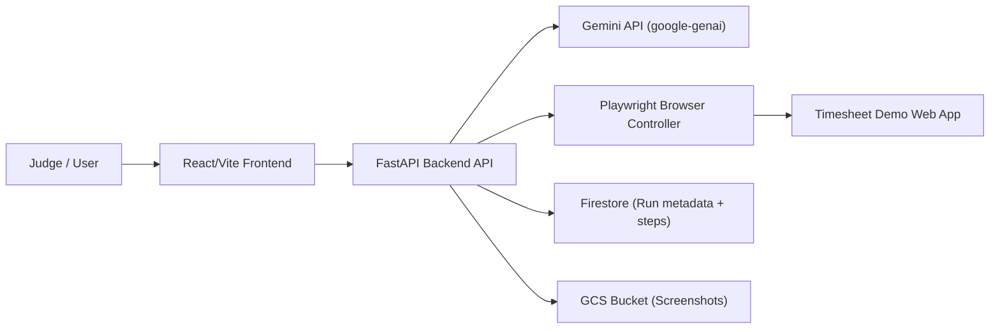

# ScreenPilot Architecture

This document explains how the **ScreenPilot** UI Navigator agent is wired together: how the **React frontend**, **FastAPI backend**, **Gemini**, **Playwright**, and **Google Cloud services** interact during a run.

## Components

### 1. Frontend – React/Vite SPA

- Built with **React + TypeScript + Vite + Tailwind CSS**.
- Renders:
  - Task selector and parameter form (e.g. week dates, hours per day).
  - Run controls (Start / Cancel).
  - Live run status panel with step cards (Decision, Why, Action, Outcome).
  - Screenshot stage and optional screenshot mini‑filmstrip.
  - Final run summary (duration, step count, failures).
- Talks to the backend over HTTP using the configured `VITE_BACKEND_BASE_URL`.

### 2. Backend – FastAPI service

- Exposes REST endpoints such as:
  - `POST /api/runs` (start a new run with task + parameters).
  - `GET /api/runs/{id}` and `GET /api/runs/{id}/steps` (poll or stream run progress).
  - `GET /api/health` (health check).
- Implements the **planner + executor loop**:
  1. Capture a screenshot from Playwright.
  2. Call Gemini with the user goal + screenshot.
  3. Parse the structured actions (click/type/scroll) into domain models.
  4. Execute actions via Playwright.
  5. Log each step and optionally persist to Firestore + GCS.
  6. Repeat until the task is complete or a stop condition is reached.

### 3. Gemini – Reasoning & action planning

- Invoked via the **Google GenAI / Gemini SDK** (`google-genai`).
- Receives:
  - The user’s **goal** (e.g. “Fill this weekly timesheet with 8 hours per weekday”).
  - The current **screenshot** of the timesheet demo web app.
  - A strict **JSON action schema** for allowed actions (click, type, scroll).
- Returns:
  - A list of structured actions and short natural‑language reasoning.
- The backend validates this output and turns it into Playwright calls.

### 4. Playwright – Browser controller

- Runs in the same container as the FastAPI backend.
- Launches a **Chromium** instance based on the `mcr.microsoft.com/playwright/python` image.
- Navigates to the **Timesheet demo web app** URL (configurable via `TIMESHEET_URL`).
- Supports:
  - Clicking buttons/links by text.
  - Typing into labeled input fields.
  - Scrolling when elements are off‑screen.
  - Capturing screenshots between action batches.

### 5. Google Cloud services

When running in **GCP mode**, the backend uses:

- **Cloud Run**
  - Hosts the container image built from `backend/Dockerfile`.
  - Receives all HTTP traffic from the frontend.
  - Injects environment variables such as `GEMINI_API_KEY`, `GCS_BUCKET_NAME`, and Firestore collection names.

- **Firestore**
  - Stores run metadata (task name, parameters, status, timestamps).
  - Stores step logs (per‑action reasoning, success/failure, screenshot references).

- **Cloud Storage (GCS)**
  - Stores full‑resolution screenshots taken during runs.
  - Backend generates signed URLs so the frontend can safely display images.

These resources are set up and wired by `backend/scripts/setup_docker_env.sh` and used by `backend/scripts/deploy_cloud_run.sh`.

## Run Lifecycle (End‑to‑End)

1. **User configures a run** in the React frontend and clicks **Run**.
2. Frontend calls the FastAPI backend (`POST /api/runs`) with task + parameters.
3. Backend:
   - Creates a run record (in‑memory or in Firestore, depending on persistence configuration).
   - Starts the planner + executor loop with Playwright and Gemini.
4. Playwright opens the **Timesheet demo web app** and captures the first screenshot.
5. Backend sends the goal + screenshot to **Gemini**, asking for structured actions.
6. Backend executes actions via **Playwright**, then:
   - Stores screenshots in **GCS**.
   - Logs each step and reasoning to **Firestore**.
7. Frontend polls or subscribes to run updates and renders:
   - Timeline cards.
   - Latest screenshot and mini‑filmstrip.
   - Status indicators (running / succeeded / failed).
8. Once the goal is complete, backend marks the run as **succeeded** (or failed with an error reason).
9. Frontend shows a **Run Summary** panel with duration, step count, and failure count.

> React frontend → FastAPI backend → Gemini (planning) + Playwright (actions) → Timesheet demo app, with Firestore + GCS on GCP and Cloud Run for hosting.
